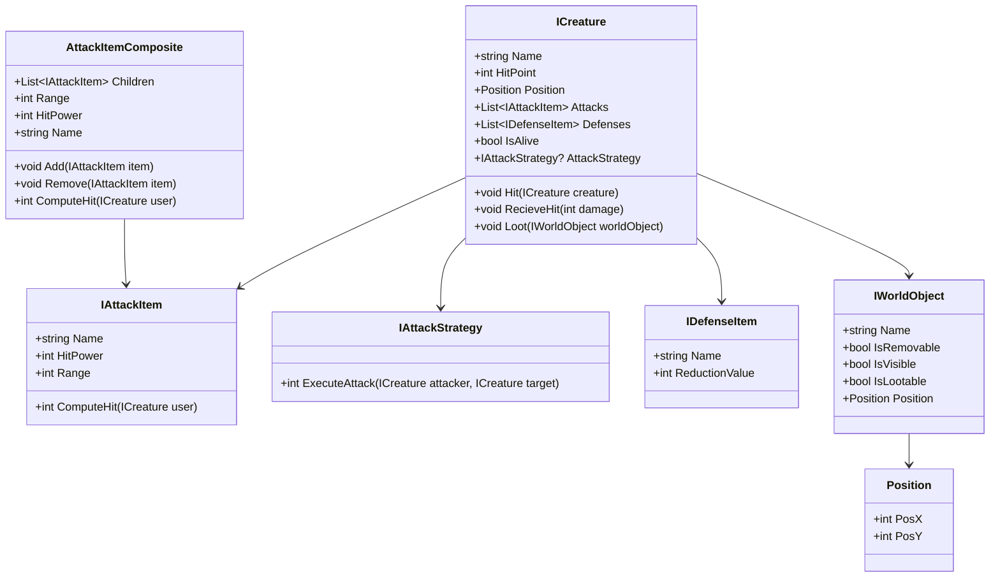

# SimpleGameFramework

## Class Diagram

The `IAttack` entities

```mermaid
classDiagram
    class IAttackItem {
        +string Name
        +int HitPower
        +int Range
        +int ComputeHit(ICreature user)
    }

    class IAttackStrategy {
        +int ExecuteAttack(ICreature attacker, ICreature target)
    }

    class AttackItemComposite {
        +List~IAttackItem~ Children
        +void Add(IAttackItem item)
        +void Remove(IAttackItem item)
        +int ComputeHit(ICreature user)
        +int Range
        +int HitPower
        +string Name
    }

    class ICreature {
        +string Name
        +int HitPoint
        +Position Position
        +List~IAttackItem~ Attacks
        +List~IDefenseItem~ Defenses
        +bool IsAlive
        +IAttackStrategy? AttackStrategy
        +void Hit(ICreature creature)
        +void RecieveHit(int damage)
        +void Loot(IWorldObject worldObject)
    }

    class IDefenseItem {
        +string Name
        +int ReductionValue
    }

    class IWorldObject {
        +string Name
        +bool IsRemovable
        +bool IsVisible
        +bool IsLootable
        +Position Position
    }

    class Position {
        +int PosX
        +int PosY
    }

    %% Relationships
    AttackItemComposite --> IAttackItem
    ICreature --> IAttackItem
    ICreature --> IDefenseItem
    ICreature --> IAttackStrategy
    ICreature --> IWorldObject
    IWorldObject --> Position
```
