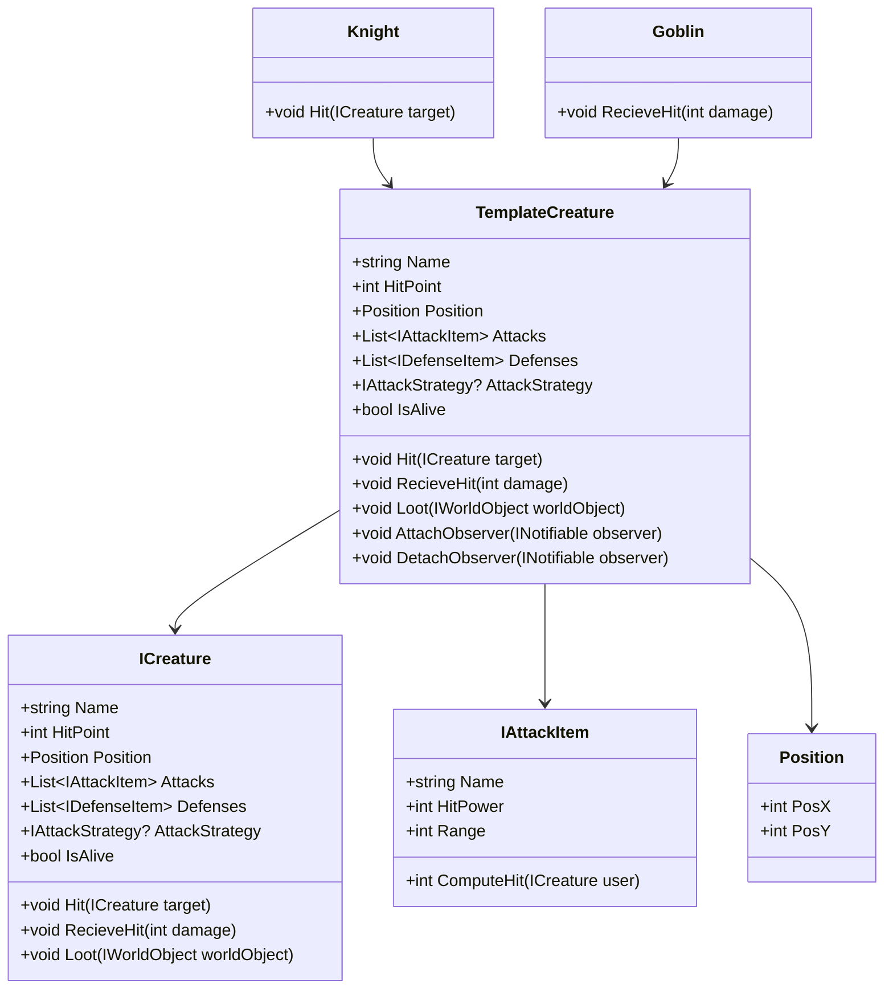
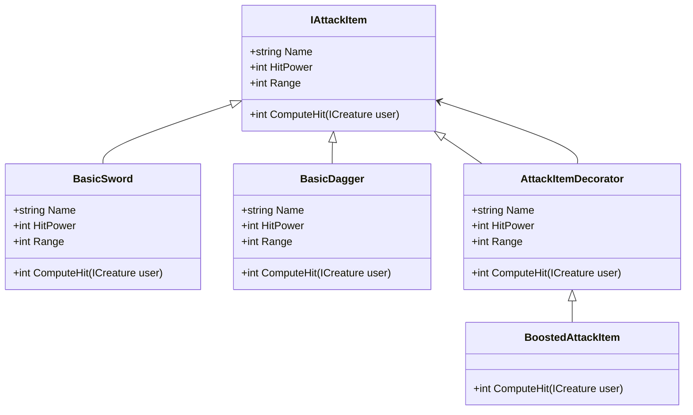
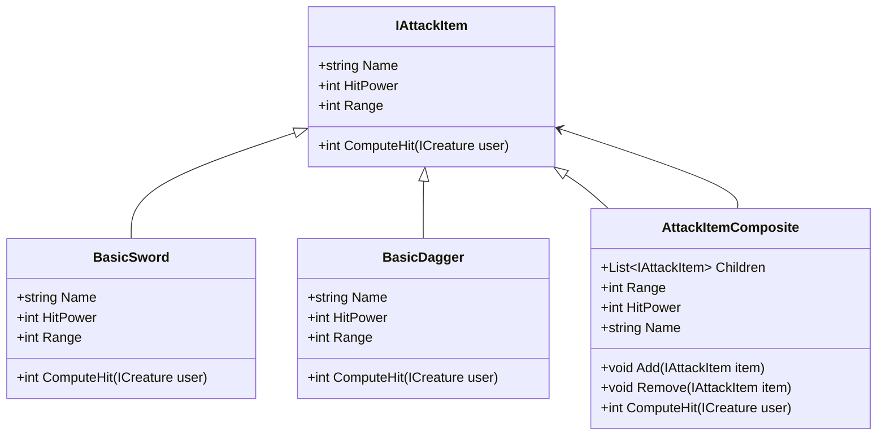
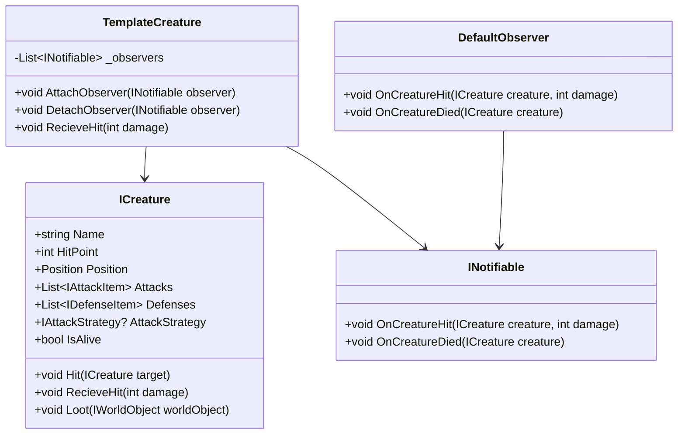
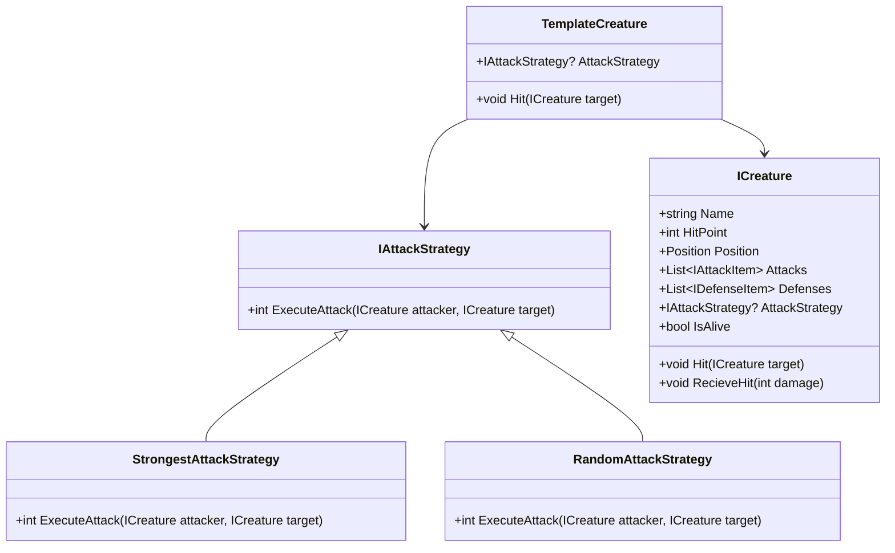

# Simple Game Framework

### Design Patterns

This Framework implements different Design Patterns:
- Template
- Decorator
- Composite
- Observer
- Strategy

#### The Template Pattern

The **Template Pattern** is implemented in the `TemplateCreature` class, which serves as an abstract base class for creatures in the game. This pattern allows subclasses to define specific behaviors while reusing common functionality provided by the base class.

##### Key Components of the Template Pattern in the Codebase

1. **Abstract Class**:
   - `TemplateCreature` is the abstract class that provides a template for all creatures.
   - It defines common properties and methods such as `Hit`, `RecieveHit`, and `Loot`.
   - Subclasses can override specific methods to provide custom behavior.

2. **Concrete Subclasses**:
   - Subclasses of `TemplateCreature` (e.g., `Knight`, `Goblin`) implement or override specific methods to define their unique behavior.

3. **Hook Methods**:
   - Methods like `Hit` and `RecieveHit` in `TemplateCreature` can be overridden by subclasses to customize behavior.



##### Explanation
1. **TemplateCreature**:
   - Acts as the **Abstract Class** in the Template Pattern.
   - Provides default implementations for methods like `Hit`, `RecieveHit`, and `Loot`.
   - Allows subclasses to override these methods to customize behavior.

2. **Knight** and **Goblin**:
   - Concrete subclasses of `TemplateCreature`.
   - Override specific methods to define their unique behavior (e.g., `Knight` overrides `Hit`, `Goblin` overrides `RecieveHit`).

3. **ICreature**:
   - Represents the interface implemented by `TemplateCreature`.

4. **IAttackItem** and **Position**:
   - Represent related entities used by `TemplateCreature`.

#### The Decorator Pattern

The **Decorator Pattern** is implemented in the `AttackItemDecorator` class and its concrete subclass `BoostedAttackItem`. This pattern allows dynamic addition of responsibilities to objects without modifying their code.

##### Key Components of the Decorator Pattern in the Codebase

1. **Component Interface**:
   - `IAttackItem` serves as the component interface, defining the contract for all attack items.

2. **Concrete Component**:
   - Classes like `BasicSword` and `BasicDagger` implement the `IAttackItem` interface and provide the base functionality.

3. **Decorator**:
   - `AttackItemDecorator` is an abstract class that implements `IAttackItem` and wraps another `IAttackItem` instance (`InnerItem`).
   - It delegates calls to the wrapped object while allowing subclasses to add or modify behavior.

4. **Concrete Decorator**:
   - `BoostedAttackItem` (not fully shown but referenced in the code) extends `AttackItemDecorator` to add specific enhancements, such as increasing the hit power of the wrapped attack item.



##### Explanation
1. **IAttackItem**:
   - Defines the interface for all attack items, including properties like `Name`, `HitPower`, and `Range`, and the method `ComputeHit`.

2. **BasicSword** and **BasicDagger**:
   - Concrete implementations of `IAttackItem` that provide base functionality.

3. **AttackItemDecorator**:
   - Abstract class that wraps an `IAttackItem` instance (`InnerItem`) and delegates calls to it.
   - Allows subclasses to override methods and add behavior.

4. **BoostedAttackItem**:
   - Concrete decorator that extends `AttackItemDecorator` to enhance the functionality of the wrapped attack item (e.g., increasing hit power).

##### Example Usage
In the `Program.cs` file:

```csharp
var basicDagger = GameFactory.Create<IAttackItem>("BasicDagger");
var dagger = new BoostedAttackItem(basicDagger!); // Decorator pattern applied
goblin.Attacks.Add(dagger!);

```
- A `BoostedAttackItem` wraps a `BasicDagger`, enhancing its behavior without modifying the original `BasicDagger` class.

#### The Composite Pattern

The **Composite Pattern** is implemented in the `AttackItemComposite` class, which allows multiple `IAttackItem` objects to be treated as a single `IAttackItem`. This pattern is useful for representing part-whole hierarchies.

##### Key Components of the Composite Pattern in the Codebase

1. **Component Interface**:
   - `IAttackItem` serves as the component interface, defining the contract for all attack items.

2. **Leaf**:
   - Classes like `BasicSword` and `BasicDagger` implement `IAttackItem` and represent individual attack items.

3. **Composite**:
   - `AttackItemComposite` implements `IAttackItem` and contains a collection of child `IAttackItem` objects.
   - It provides methods to add and remove child items and delegates operations like `ComputeHit` to its children.




##### Explanation
1. **IAttackItem**:
   - Defines the interface for all attack items, including properties like `Name`, `HitPower`, and `Range`, and the method `ComputeHit`.

2. **BasicSword** and **BasicDagger**:
   - Concrete implementations of `IAttackItem` that represent individual attack items (leaves in the composite structure).

3. **AttackItemComposite**:
   - Implements `IAttackItem` and acts as a composite, containing a collection of child `IAttackItem` objects.
   - Provides methods to add and remove child items (`Add` and `Remove`).
   - Delegates operations like `ComputeHit` to its children, aggregating their results.

##### Example Usage
In the `Program.cs` file:


```csharp
var sword = GameFactory.Create<IAttackItem>("BasicSword");
var bash = GameFactory.Create<IAttackItem>("BasicBash");
var swordAndBash = new AttackItemComposite();
swordAndBash.Add(sword!); // Composite pattern applied
swordAndBash.Add(bash!); // Composite pattern applied
knight.Attacks.Add(swordAndBash!);


```
- A composite `swordAndBash` is created by combining a `BasicSword` and a `BasicBash`.
- The composite is treated as a single `IAttackItem` and added to the knight's attacks.

#### The Observer Pattern

The **Observer Pattern** is implemented in the `TemplateCreature` class, which allows external objects (observers) to be notified of specific events, such as when a creature is hit or dies.

##### Key Components of the Observer Pattern in the Codebase

1. **Subject**:
   - The `TemplateCreature` class acts as the subject. It maintains a list of observers (`_observers`) and provides methods to attach and detach them:
	 - `AttachObserver(INotifiable observer)`
	 - `DetachObserver(INotifiable observer)`

2. **Observer Interface**:
   - The `INotifiable` interface defines the contract for observers, including methods like:
	 - `OnCreatureHit(ICreature creature, int damage)`
	 - `OnCreatureDied(ICreature creature)`

3. **Concrete Observers**:
   - Any class implementing the `INotifiable` interface can act as an observer. These classes are notified when specific events occur in the `TemplateCreature`.

4. **Notification**:
   - The `RecieveHit` method in `TemplateCreature` notifies all attached observers by calling their `OnCreatureHit` method.
   - If the creature dies, the observers are notified via the `OnCreatureDied` method.



##### Explanation
1. **TemplateCreature**:
   - Acts as the **Subject** in the Observer Pattern.
   - Maintains a list of observers (`_observers`) and provides methods to attach and detach them.
   - Notifies observers when the creature is hit (`OnCreatureHit`) or dies (`OnCreatureDied`).

2. **INotifiable**:
   - Defines the **Observer Interface** with methods for handling events like `OnCreatureHit` and `OnCreatureDied`.

1. **DefaultObserver**:
   - A potential concrete implementation of `INotifiable` that logs events when a creature is hit or dies.

4. **ICreature**:
   - Represents the base interface for creatures, which `TemplateCreature` implements.

##### Example Usage
In the `TemplateCreature` class:


```csharp
public void AttachObserver(INotifiable observer)
{
    if (!_observers.Contains(observer))
        _observers.Add(observer);
}

public void RecieveHit(int damage)
{
    int reduced = Defenses.Sum(d => d.ReductionValue);
    int finalDamage = Math.Max(0, damage - reduced);
    HitPoint -= finalDamage;

    foreach (var observer in _observers)
    {
        observer.OnCreatureHit(this, finalDamage);
    }

    if (!IsAlive)
    {
        foreach (var observer in _observers)
        {
            observer.OnCreatureDied(this);
        }
    }
}


```

#### The Strategy Pattern

The **Strategy Pattern** is implemented in the `TemplateCreature` class through the use of the `IAttackStrategy` interface. This pattern allows the behavior of an attack to be selected at runtime by assigning a specific implementation of `IAttackStrategy` to the `AttackStrategy` property of a creature.

##### Key Components of the Strategy Pattern in the Codebase

1. **Context**:
   - The `TemplateCreature` class acts as the context. It uses the `IAttackStrategy` interface to execute an attack strategy.
   - The `AttackStrategy` property in `TemplateCreature` allows the strategy to be dynamically assigned.

2. **Strategy Interface**:
   - The `IAttackStrategy` interface defines the contract for all attack strategies:


```csharp
public interface IAttackStrategy
{
    int ExecuteAttack(ICreature attacker, ICreature target);
}

```

3. **Concrete Strategies**:
   - Specific implementations of `IAttackStrategy` define different attack behaviors:
	 - `StrongestAttackStrategy`: Executes the strongest attack based on the highest computed hit value.
	 - `RandomAttackStrategy`: Executes a random attack from the available attack items.

4. **Usage in `TemplateCreature`**:
   - The `Hit` method in `TemplateCreature` uses the assigned `AttackStrategy` to execute an attack:


```csharp
if (AttackStrategy != null)
{
    int damage = AttackStrategy.ExecuteAttack(this, target);
    target.RecieveHit(damage);
    return;
}

```




##### Explanation
1. **TemplateCreature**:
   - Acts as the **Context** in the Strategy Pattern.
   - Has a property `AttackStrategy` of type `IAttackStrategy` that allows dynamic assignment of attack strategies.
   - Uses the `AttackStrategy` in the `Hit` method to execute the attack logic.

2. **IAttackStrategy**:
   - Defines the **Strategy Interface** with the method `ExecuteAttack`.

3. **StrongestAttackStrategy** and **RandomAttackStrategy**:
   - Concrete implementations of the `IAttackStrategy` interface.
   - Provide specific attack behaviors:
	 - `StrongestAttackStrategy`: Selects the attack with the highest computed hit value.
	 - `RandomAttackStrategy`: Selects a random attack from the available attack items.

4. **ICreature**:
   - Represents the base interface for creatures, which `TemplateCreature` implements.

##### Example Usage
In the `Program.cs` file:

```csharp
var knight = new Knight("Knight", 100, new Position(1, 1));
var goblin = new Goblin("Goblin", 50, new Position(2, 2));

// Assign a strongest attack strategy to the knight
knight.AttackStrategy = new StrongestAttackStrategy();

// Assign a random attack strategy to the goblin
goblin.AttackStrategy = new RandomAttackStrategy();

// Simulate attacks
knight.Hit(goblin);
goblin.Hit(knight);

```

##### Benefits of the Strategy Pattern
- **Flexibility**: Different attack behaviors can be easily swapped at runtime.
- **Open/Closed Principle**: New strategies can be added without modifying existing code.
- **Separation of Concerns**: The attack logic is encapsulated in separate strategy classes, making the `TemplateCreature` class simpler.
